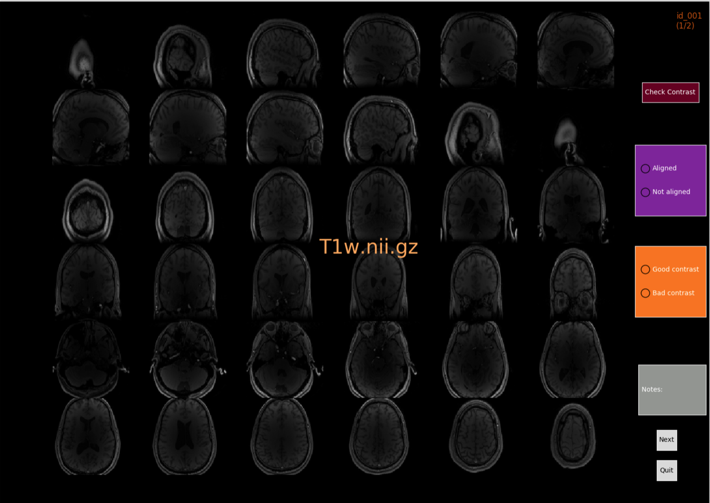

---

---

---

---

---

---

---

---
Added: map_t2 @Joao Periquito & @agahkarakuzu @tanguyduval

---
Improved: Sensitivity analysis (over SNR axis)

---
TODO: Add heatmap for cutoff

---
Added: DCE @benoitmoreau 

---
AND IT WORKS! 

---
---
Added/Improved: Multi-echo combine for QSM @jeremiefoquet

---

---
`mt_sat` in visualqc!
